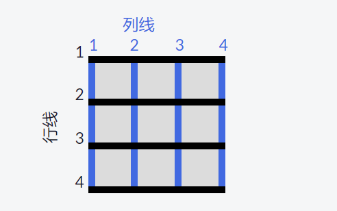

# grid布局

## `grid-template-columns`

* 定义列，属性值的个数表示网格的列数，每个值表示相应列的宽度，如：100px 100px 表示两列，每一列宽度为100px
* 属性值可用的单位有auto,px,%,fr(设置列或行占剩余空间的比例),（minmax(50px,200px) 表示列/行的最大宽/高为50px和200px）
可使用repeat指定重复的行数或列数，如：grid-template-columns:repeat(10,50px) 10px或repeat(2,10px 15px) 20px
* repeat(auto-fill,minmax(60px,1fr))创建弹性布局，根据容器大小，尽可能多的放入指点个大小的行或列。
* repeat(auto-fit,minmax(60px,1fr))创建弹性布局，根据容器大小，尽可能多的放入指点个大小的行或列,不同于auto-fill在行/列多余时放入空单元格，auto-fit会拉伸单元格以填满行/列。

## `grid-columns-gap`  

设置列与列之间的间距

## `grid-template-rows`  

定义行，属性值的个数表示网格的行数，每个值表示相应行的高度

## `grid-row-gap`  

设置行与行之间的间距

## `grid-gap`  

同时设置行与行，列与列的间距，可以接受一个值（同时设置行、列间距）或两个值（分别设置行、列间距）

## `grid-column`  

子元素属性，设置当前子元素占用网格多列的列线开始和列线结束位置，如grid-column:2/4

## `grid-row`

子元素属性，设置当前子元素占用网格多行的行线开始和行线结束位置

## `justify-self`

子元素属性，设置当前子元素在单元格水平方向的对齐方式

* start 左对齐
* center 居中
* end 右对齐
* stretch  默认值，会使内容占满单元格宽度

## `align-self`

子元素属性，设置当前子元素在单元格垂直方向的对齐方式

## `justify-items`  

网格容器元素属性，设置所有的网格项的水平对齐方式

## `align-items`  

网格容器元素属性，设置所有的网格项的垂直对齐方式

## `grid-template-areas`  

网格容器属性，定义网格的区域，并指定名称，注意，一个网格一个名称，必须与网格的行列数相同

## `grid-areas`  

子元素属性,配合grid-template-areas使用，设置当前的网格占用指定的网格名称区域,也可以使用行数和列数指定，如：开始行数/开始列数/结束行数/结束列数
